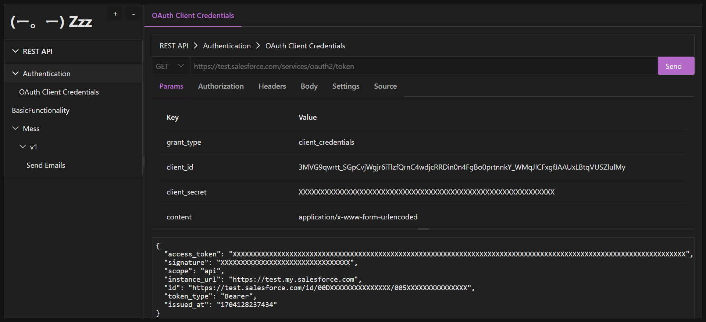
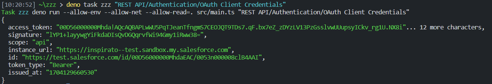
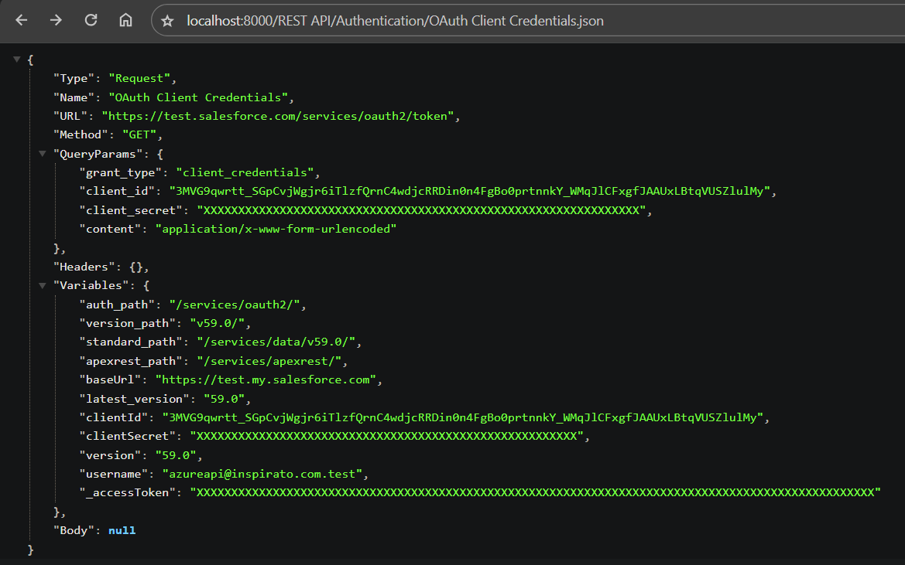

# (ー。ー) Zzz

> Pronounced as "zees" or "zeds" depending on where you live.

Zzz came out of the desire for a light replacement to Postman with generally the same features list. From there came the idea of making it be both storage- and user interface-agnostic. Lastly, different renderers can be used to alter the output

**Postman feature parity:**

- Request attributes:
  - Method
  - URL
  - Query params
  - Authorization
  - Headers
  - Body
- Environments and Globals (aka Scopes)
- Local variables (more Scopes)
- Default values per folder or collection (aka Variables)

**Planned**:

- Cookie jar
- Settings (per-request)
  - Disable cookie jar
  - Follow redirects (3xx)
  - Follow original HTTP method (instead of redirecting to GET)
  - Follow Authorization Header
  - Remove referrer header on redirect
  - Enable strict HTTP parser???
  - Encode URL automatically (path, query parameters, authentication fields)
  - Maximum number of redirects


# Usage

Run `--help` for more detail on flag usages and shorthands.

- `--scope <name>`: The name of the scope to use
- `--context <name>`: The name of the context to use
- `--http`: Start the HTTP server, defaults to port 8000
- `--web`: Start the Web (Vite) server, defaults to port 5173


## Web



```shell
# Starts the web server (Vite)
$ zzz --web

# ...is how we want to do it,
# but right now we have to do
$ deno task web
```

Currently read only and still a work in progress but coming along very nicely!

Response panel needs a lot of attention;

breadcrumbs shouldn't actually be clickable until there's a tab for configuring folder settings. Also, the ability to see folder settings.


## CLI



```shell
# Makes HTTP request and outputs response
$ zzz "Folder Name/Request Name"
```

---

Outside of the sense of a workspace of requests, for the file storage driver, a request can contain every bit of information it needs due to the way melding the files works. That means you can store a request as YAML and run it on demand.

```yaml
Method: POST
URL: "{{baseUrl}}{{auth_path}}token"
Authorization:
  BasicAuth: 32tersgvzfwt45g54=
QueryParams:
  grant_type: client_credentials
  client_id: "{{clientId}}"
  client_secret: "{{clientSecret}}"
  content: application/x-www-form-urlencoded
Variables:
  clientId: XXXXXXX
  clientSecret: XXXXXXXX
  baseUrl: https://test.salesforce.com
  auth_path: /services/oauth2/
```


## REST



This is itself an API that serves up the Zzz resources so that they can be used for other applications, like the web frontend. It is a basic REST API that maps URLs one-to-one with Requests; in other words, the path to retrieve the Request from the Store is the contents of the URL to get it from the server. The Request named "OAuth Client Credentials" in the folder "Authentication" would translate to the URL http://127.0.0.1:8000/Authentication/OAuth%20Client%20Credentials

This API can behave in one of two ways:

  - GET: Responds with information about the subject Request
  - POST: Performs the subject Request and responds with its results

That is to say, performing a GET on `http://127.0.0.1:8000/Duck.json` would give you the JSON with the definition of the request, something like

```json
{
  "Id": "ddg"
  "URL": "https://ddg.gg",
  "METHOD": "GET"
}
```

Meanwhile, performing a POST on `http://127.0.0.1:8000/Duck.json` - that same endpoint - would actually perform `GET https://ddg.gg` and pass along its results.

Adding a file extension to the end will change what format is returned: `http://127.0.0.1:8000/Duck.json` will yield the result as JSON and `http://127.0.0.1:8000/Duck.curl` will do it as the equivalent curl command as plaintext.

- json
- yml
- xml
- txt
- curl

### POST

## TUI

This would be SO sick and I think it should just be a matter of finding an ncurses-like library for Node and then getting the UI right


# Architecture

> NOTE: This is gonna change a lot

## Storage

The way that Zzz accesses requests, environments, variables and etc are done through an interface called IStore.

- FileStore: Store each request in separate file; can use yml, json, or xml

## Actors

An Actor is responsible for taking a fully loaded Request, performing an action on it, and yielding a result. Note that Actors are _not_ responsible for formatting the result.

The supported actors are:

- Client: Performs the HTTP request and returns its response. NOTE: just the body for now; nothing else more like headers or status
- Curl: Outputs an equivalent `curl` command similar to Postman
- Summary: Outputs the result as plaintext
- Pass: Just passes the Request through

## Hooks

TODO: Needs its own modularity, or part of the Store?


# Models

### Scope

Replaces Workspace; e.g. "Salesforce Primary"

```yml
Id: string
Name: string
Defaults?:
  key: value
```

### Collection

Represents both Collections and Folders

```yml
Id: string
Name: string
WorkspaceOrCollectionId: id
AuthorizationId?: id
Defaults?:
  key: value
```

### Entity

Replaces Request

```yml
Id: string
Name: string
CollectionId: id
Method: GET | POST | PUT | PATCH | DELETE | OPTIONS
URL: string
Headers?:
 - key: value
QueryParams?:
 - key: value
PathParams?:
 - key: value
```

### Context

Replaces Environment

```yml
Id: string
Name: string
Defaults?:
  key: value
```

### Authorization

> Note: This Model is supplied by the Authorization module

An Authorization can be a part of a Workspace, a Collection, or a File, but it can also be defined on its own so that it can be referenced by multiple entities.

```yml
BasicAuth:
  Username: "{{_username}}"
  Password: "{{_password}}"
```
```yml
BearerToken: "{{_accessToken}}"
```
```yml
Header:
  Name: "{{_authHeader}}"
  Value: "{{_apiToken}}"
```
```yml
Query:
  Param: "{{_authParam}}"
  Value: "{{_apiToken}}"
```

## Modules

These provide extra manipulation after a Model has been loaded from the Store and before it has been passed to the Actor.

### Body

This module will further process the `Body` attribute on Entities.

The Body is optional and can be one of three options:

1. Object

```yml
Body:
  Some:
    Nested:
      - structure
    Of: Values
```

2. String

```yml
Body: '{ "Key": "Value" }'
```

3. File

TODO: How will it know this being different from the above?
Maybe if it starts with `@`? or use two different ones, `Body` and `BodyFile`? that would require validation of only one being present.

```yml
Body: filepath ???
```

### Authorization

The Authorization module allows reuse of Authorizations so that Models can refer to them by name.

Example Entity using a manual Authentication:

```yml
Url: /
Method: GET
Authorization:
  BasicAuth:
    Username: foo
    Password: bar
```

The Authorization Module can be used to extract this to an Authorization Model record.

Example `foobar` Authorization:
```yml
BasicAuth:
  Username: foo
  Password: bar
```

Previous example using the Authorization module:
```yml
Url: /
Method: GET
Authorization: foobar
```

### Variables

This module resolves all variable values for a given Model to help yield an actionable Model. Zzz will apply the following in order:

- globals
- globals (local)
- environment
- environment (local)
- defaults
- the model itself

The defaults will walk up the Collection tree applying all defaults as needed.

As a concrete example let us look at the File store. At the defaults stage, Zzz will check every directory down in the path to the Request for a file named `_defaults.yml`.

For example, supposed you had the following:

- `v1/defaults.yml`
- `v1/Auth/defaults.yml`
- `v1/Auth/Token.yml`
- `v1/Foo/defaults.yml`
- `v1/Foo/Bar.yml`

When making the `Authorization/Token` request, it will find and apply these files in this order:

- `v1/defaults.yml`
- `v1/Auth/defaults.yml`
- `v1/Auth/Token.yml`

This allows `v1/Foo/defaults.yml` to use an `Authorization` like BearerToken whereas `v1/Auth/Token.yml` needs to _not_ have any Authorization specified. We can do this by using `v1/Auth/defaults.yml` to unset `Authorization`.


# Interfaces

## Interface Definition

1. Specify Context
2. CRUD
    - Get Entity
    - Get Collection (returns Collections/Entities)
    - Get Contexts (Globals is just a special context. maybe I should rename it to "All"?)
    - Get Authorizations
    - Get Authorization
4. Format
5. Act (execute) - perform request as passthrough

## REST/Act Server

1. Specify Context
    - Header: `X-Zzz-Context`
    - QueryParam: `?context`
2. CRUD
    - POST `/:id`
    - GET `/:id`
    - PUT `/:id`
    - DELETE `/:id`
    - Authorizations = TODO
3. Format = "format" query param
4. Act on Entity = PATCH

1. OPTIONS works because of CORS
2. The file extension used in the request determines the return format
    - json
    - yml
    - xml
    - txt
    - curl

## Web

1. Specify Context = dropdown TODO
2. CRUD
    - Entity
    - Collection
    - Context
    - Authorization
3. Format = Show Variables
4. Act on Entity = Send

1. Navigate Collections to select a child
2. Navigate Contexts TODO
3. View Response
4. Tabbed Entities


## CLI

1. Specify Context = ZZZ_CONTEXT environment variable
2. CRUD - `[--type entity|collection|context|auth] <id>`
    - `zzz --create ...`
    - `zzz <id>`
    - `zzz --edit <id> ...`
    - `zzz --delete <id>`
3. Format = `--format`
4. Act on Entity = `zzz --execute <id>` or `zzz -x <id>`


## TUI

TODO

21. Specify Context
2. CRUD
3. Format
4. Act on Entity


## Browser Extensions

TODO

# Comparison / Inspiratos

## Zzz
  - License: OSL
  - Platforms
    - CLI
    - TUI TODO
    - REST/Act
    - Web
    - Desktop (Tauri) TODO
    - Browser extensions? TODO
  - Technologies:
    - Runtime: Deno
    - Language: Typescript
    - Server: Vite
    - Front end: Vue
    - Desktop: Tauri
    - Readline: [tui](https://deno.land/x/tui@2.1.7)
  - Notable Features:
    - Hooks (JS) TODO
    - Modules (e.g. Authorization, Body)
  - Storage:
    - YAML
    - JSON
    - XML
    - SQLite TODO
    - Postman TODO
    - [Bru](https://docs.usebruno.com/bru-lang-overview.html)
    - [Hurl](https://hurl.dev)
  - Extras:
    - VS Code extension TODO?

## [Bruno](https://github.com/usebruno/bruno)

  - License: MIT
  - Platforms
    - Desktop (Electron)
    - CLI
  - Technologies:
    - Runtime: Nodejs
    - Language: Javascript
    - Server: Webpack
    - Front end: ???
    - Desktop: Electron
  - Notable Features:
    - GraphQL
    - Declarative scripting...though Bru files appear to have Javascript?
    - Declarative tests?
  - Storage: [Bru](https://docs.usebruno.com/bru-lang-overview.html)
  - Extras:
    - VS Code extension
  - Pros of Zzz:
    - REST/Act
    - Web
    - TUI

## [Restfox](https://github.com/flawiddsouza/Restfox)

[Try live](restfox.dev)

  - License: MIT
  - Platforms:
    - Web
    - Desktop (Tauri & Electron)
    - [Chrome extension](https://chromewebstore.google.com/detail/restfox/fihmegnabgglklkppphibngblkomlhcn)
  - Technologies:
    - Runtime: Nodejs
    - Language: Javascript
    - Server: Express
    - Front end: Vue
    - Desktop: Tauri & Electron
  - Notable Features:
    - GraphQL
    - Plugins (Javascript)
  - Storage: IndexedDB (via [Dexie](https://dexie.org/))
  - Extras:
  - Pros of Zzz:
    - CLI
    - TUI


## Yaade

TODO

## RecipeUI

TODO

## Hoppscotch

TODO


## [Hello HTTP](https://github.com/sunny-chung/hello-http)

  - License: Apache 2.0
  - Platforms: Desktop
  - Technologies:
    - Runtime: JVM
    - Language: Kotlin
    - Front end: [Jetpack](https://developer.android.com/jetpack/androidx/)
    - Desktop: Jetpack
  - Notable Features:
    - Websockets
    - GraphQL
  - Storage: [ExperimentalSerializationApi](https://kotlinlang.org/api/kotlinx.serialization/kotlinx-serialization-core/kotlinx.serialization/-experimental-serialization-api/)?
  - Pros of Zzz:
    - CLI
    - TUI
    - Web
    - REST/Act


## [Advanced REST Client](https://github.com/advanced-rest-client/arc-electron)

TODO

  - License: Apache 2.0
  - Platforms: Desktop
  - Technologies:
    - Runtime: Nodejs?
    - Language: Javascript
    - Server: ???
    - Front end: ???
    - Desktop: Electron
  - Notable Features:
  - Storage
  - Pros of Zzz:


## Another...

  - License:
  - Platforms:
  - Technologies:
  - Notable Features:
  - Storage
  - Pros of Zzz:


# TODO

Examples for requests. That's a lot of work.
Parsing body, notably as an external file.
Path params as a module
Sequence, somehow
Why the hell is primevue/menuitem not cached by Deno?

backend:
  - Contexts
  - Sweet mother of god, fix the design pattern in serve.ts
    - Add workspace entity for Get, and some command to get all workspaces
  - Create auth UI for bulk edit and creation
  - Cookie jar
  - Redo Hooks so it's not only file-based
  - find xmlStringify

Frontend:
  - Contexts
  - Scopes
  - form-* Body
  - binary Body
  - Settings tab

### Bonus

- TUI
- Determine parser based on the supplied content-type header instead of having to do extension?
- Where should we write to for Postman Store?
- More Stores & parsers; TOML, SQLite
- GET Image
- Tooltip over variables to show their resolved values


### Polish
- Expand & Collapse All
- Remove in all tables
- Remove in accordions
