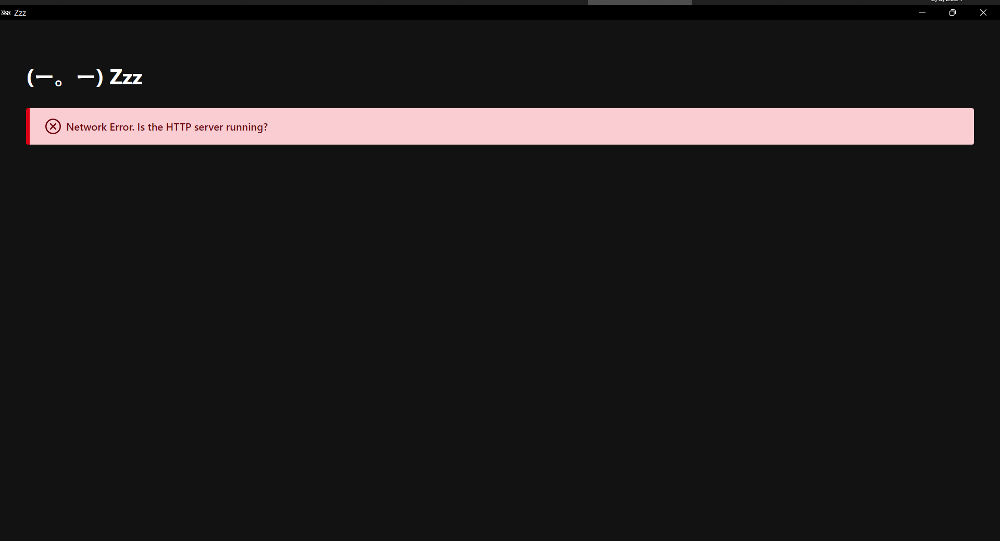

# (ー。ー) Zzz

>

Zzz (pronounced as "zees" or "zeds" depending on where you live) is a **REST client** meant to be a replacement to Postman with generally the same features list.

What sets it apart from other Postman alternatives is its modularity and the way it approaches modularity. The result is many different interfaces to access many different types of storage.

Zzz can be used as a workspace of requests and variables, but it can also be used to run requests entirely stored in a single file, like so:

```yaml
Method: POST
URL: "{{baseUrl}}{{auth_path}}token"
Authorization:
  BasicAuth: 32tersgvzfwt45g54=
QueryParams:
  grant_type: client_credentials
  client_id: "{{clientId}}"
  client_secret: "{{clientSecret}}"
  content: application/x-www-form-urlencoded
Variables:
  clientId: XXXXXXX
  clientSecret: XXXXXXXX
  baseUrl: https://test.salesforce.com
  auth_path: /services/oauth2/
```

Further [documentation](docs) in recommended reading order:

  - [Architecture](docs/architecture.md)
  - [Models](docs/models.md)
  - [Modules](docs/modules.md)
  - [Interfaces](docs/interfaces.md)
  - [Collaboration](docs/collaboration.md)
  - [Alternatives to Zzz](docs/alternatives.md)


## Postman feature parity

- Request attributes:
  - Method
  - URL
  - Query params
  - Authorization
  - Headers
  - Body
- Environments and Globals (aka Scopes)
- Local variables (more Scopes)
- Default values per folder or collection (aka Variables)
- Cookie jar

**Planned**:

- Settings (per-request)
  - Disable cookie jar
  - Follow redirects (3xx)
  - Follow original HTTP method (instead of redirecting to GET)
  - Follow Authorization Header
  - Remove referrer header on redirect
  - Enable strict HTTP parser???
  - Encode URL automatically (path, query parameters, authorization fields)
  - Maximum number of redirects


# Interfaces

#### Web


Presently this also requires the REST API to be running

### Desktop


Yeah, it's broken, but how cool is it that tauri builds?

#### REST API


### CLI


Run `--help` or `-h` or `?` for more detail on flag usages and shorthands.

### TUI

TODO
